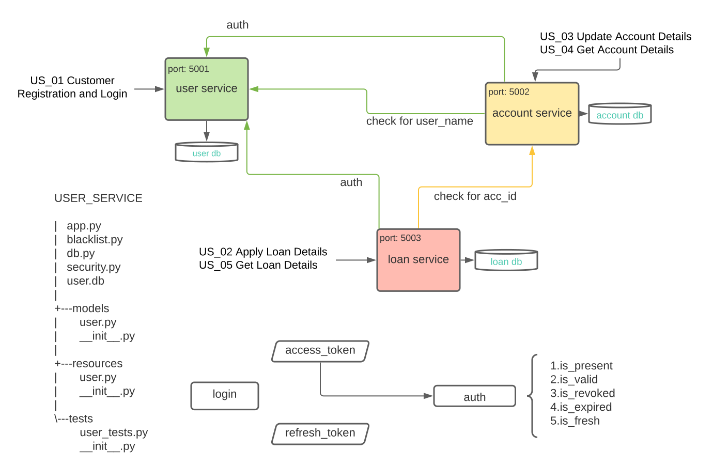

# bank-management-system   
### python3, flask-restful, SQLAlchemy, flask_jwt_extended, pytest   
   
   
   
## How to run
> requirements:   
    - python3 in cmd   
    - install pipenv   
     ```pip install pipenv```      
    - cd to bank-management-system folder   

### for run
install the last successful environment for run   
```pipenv install --ignore-pipfile```      
run registration service   
```python src\user_service\app.py```   
run account service   
```python src\account_service\app.py```   
run loan service   
```python src\loan_service\app.py```   

### for dev
install the last successful environment for developement   
```pipenv install --dev```     
for testing   
```coverage run -m pytest <test_files_path>```   
```coverage run -m pytest src/user_service/tests/user_tests.py```  
```coverage run -m pytest src/account_service/tests/account_tests.py```   
```coverage run -m pytest src/loan_service/tests/loan_tests.py``` 

check test coverage   
```coverage report -m```   

user service endpoints(port: 5001):
```
/user/register [POST]
/user/ispresent [POST]
/user/<int:user_id> [GET, DELETE]
/user/login [POST, GET]
/user/refresh [POST]
/user/logout [POST]
```  
   
account service endpoints(port: 5002):
```
/account [GET, PUT]
/account/ispresent [POST]
```
loan service endpoints(port: 5003):
```
/loan [GET, POST]
```


